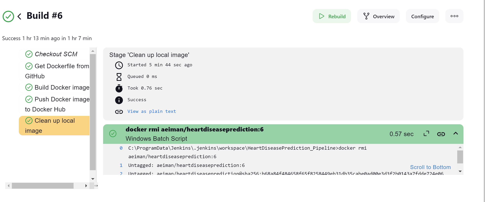

# HeartDiseasePrediction

The Heart Disease Prediction Model CI/CD Pipeline project aims to develop and deploy a machine learning model for predicting heart disease, while implementing a Continuous Integration/Continuous Deployment (CI/CD) pipeline to ensure efficient development, testing, and deployment processes.

